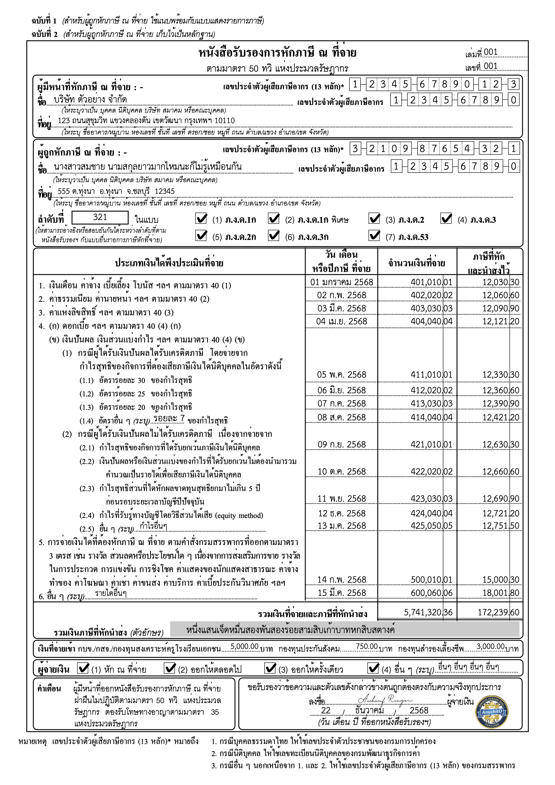

# pdf50tawi

[](https://golang.org)
[](LICENSE)

Go library สำหรับสร้างไฟล์ PDF หนังสือรับรองการหักภาษี ณ ที่จ่าย (แบบ 50 ทวิ) พร้อมรองรับภาษาไทยเต็มรูปแบบ

Go library for generating Thai Withholding Tax certificates (แบบ 50 ทวิ) as ready-to-sign PDFs with full Thai language support.



---

## เริ่มต้นใช้งาน / Quick start

```bash
go get github.com/anuchito/pdf50tawi
```

```go
package main

import (
    "os"
    "github.com/anuchito/pdf50tawi"
)

func main() {
    // กรอกข้อมูลภาษี
    taxInfo := pdf50tawi.TaxInfo{
        Payer: pdf50tawi.Payer{
            TaxID:   "1234567890123",
            Name:    "บริษัท ตัวอย่าง จำกัด",
            Address: "123 ถนนสุขุมวิท แขวงคลองตัน เขตวัฒนา กรุงเทพฯ 10110",
        },
        Payee: pdf50tawi.Payee{
            TaxID: "3210987654321",
            Name:  "นาย ผู้รับเงิน",
            Pnd_3: true, // ระบุประเภท ภ.ง.ด. ที่ใช้
        },
        Income40_1: pdf50tawi.IncomeDetail{
            DatePaid:    "01 มกราคม 2568",
            AmountPaid:  "100,000.00",
            TaxWithheld: "3,000.00",
        },
        Totals: pdf50tawi.Totals{
            TotalAmountPaid:         "100,000.00",
            TotalTaxWithheld:        "3,000.00",
            TotalTaxWithheldInWords: "สามพันบาทถ้วน",
        },
        WithholdingType: pdf50tawi.WithholdingType{WithholdingTax: true},
        Certification: pdf50tawi.Certification{
            DateOfIssuance: pdf50tawi.DateOfIssuance{Day: "1", Month: "มกราคม", Year: "2568"},
        },
    }

    // โหลดรูปลายเซ็นและตราประทับ
    sign, _ := pdf50tawi.LoadImageFromFile("signature.png")
    seal, _ := pdf50tawi.LoadImageFromFile("logo.png")

    // สร้างไฟล์ PDF
    out, _ := os.Create("certificate.pdf")
    defer out.Close()

    pdf50tawi.IssueWHTCertificatePDF(out, taxInfo, sign, seal)
}
```

---

## โหลดรูปภาพ / Loading images

library รับรูปภาพเป็น `io.Reader` ซึ่งมี helper function ให้เลือกใช้ตามแหล่งที่มาของรูป

The library accepts any `io.Reader` for the signature and seal. Use whichever helper matches your image source:

```go
// จากไฟล์ในเครื่อง / From a local file
sign, err := pdf50tawi.LoadImageFromFile("signature.png")

// จาก multipart upload (net/http) / From a multipart upload
sign, err := pdf50tawi.LoadImageFromMultiPartFile(r, "signature")

// จาก URL สาธารณะ / From a public URL
sign, err := pdf50tawi.LoadImageFromURL("https://storage.example.com/signature.png")

// จาก URL ที่ต้องใช้ auth — สร้าง request เองด้วย standard library
// From a private/authenticated URL — build the request yourself
req, _ := http.NewRequestWithContext(ctx, http.MethodGet, url, nil)
req.Header.Set("Authorization", "Bearer "+token)
sign, err := pdf50tawi.LoadImageFromRequest(req)
```

> ถ้าไม่มีรูปลายเซ็นหรือตราประทับ ส่ง `nil` ได้เลย — ระบบจะข้ามช่องนั้นให้อัตโนมัติ
>
> Pass `nil` for either image to omit it from the certificate.

---

## REST API — 3 วิธีส่งรูปภาพ / 3 image strategies

server ตัวอย่าง ([`cmd/rest`](cmd/rest/README.md)) แสดง 3 วิธีส่งรูปภาพมากับ request ให้เลือกใช้ตามความเหมาะสม ดูรายละเอียดเพิ่มเติมได้ที่ [cmd/rest/README.md](cmd/rest/README.md)

The included server ([`cmd/rest`](cmd/rest/README.md)) demonstrates three ways to supply images over HTTP — see [cmd/rest/README.md](cmd/rest/README.md) for the full reference. Run the demo to see all three strategies in action:

```bash
./scripts/demo-rest.sh
```

| วิธี / Strategy | Endpoint | เหมาะเมื่อ / When to use |
|----------------|----------|--------------------------|
| **A** Multipart upload | `POST /api/v1/taxes/multipart` | client upload ไฟล์โดยตรง |
| **B** Base64 ใน JSON | `POST /api/v1/taxes/base64` | API client ที่รับส่งแค่ JSON |
| **C** ส่ง URL มา | `POST /api/v1/taxes/url` | รูปอยู่บน CDN / S3 อยู่แล้ว |

**วิธี A — multipart/form-data**
```bash
curl -X POST http://localhost:8080/api/v1/taxes/multipart \
  -F "taxInfo={...}" \
  -F "signature=@signature.png" \
  -F "seal=@logo.png" \
  -o certificate.pdf
```

**วิธี B — base64 ใน JSON body**
```bash
curl -X POST http://localhost:8080/api/v1/taxes/base64 \
  -H "Content-Type: application/json" \
  -d '{
    "taxInfo": {...},
    "signatureBase64": "<base64>",
    "sealBase64": "<base64>"
  }' \
  -o certificate.pdf
```

**วิธี C — ส่ง URL ให้ server ดึงเอง**
```bash
curl -X POST http://localhost:8080/api/v1/taxes/url \
  -H "Content-Type: application/json" \
  -d '{
    "taxInfo": {...},
    "signatureURL": "https://cdn.example.com/signature.png",
    "sealURL": "https://cdn.example.com/logo.png"
  }' \
  -o certificate.pdf
```

---

## CLI

```bash
# รันด้วยข้อมูลตัวอย่าง / Run with demo data
./scripts/demo-cli.sh

# รันด้วยรูปของคุณเอง / Run with your own images
go run ./cmd/cli \
  --signature path/to/signature.png \
  --seal      path/to/logo.png \
  --output    certificate.pdf
```

---

## ข้อกำหนดรูปภาพ / Image requirements

รูปภาพควรเป็น **PNG พื้นหลังโปร่งใส** และมีขนาดตามนี้เพื่อให้ตรงกับช่องในฟอร์ม

| รูป / Image | ขนาด / Dimensions | รูปแบบ / Format |
|-------------|-------------------|-----------------|
| ลายเซ็น / Signature | 1280 × 720 px | PNG, พื้นหลังโปร่งใส |
| ตราประทับ / Seal (สี่เหลี่ยมจัตุรัส) | 1024 × 1024 px | PNG, พื้นหลังโปร่งใส |
| ตราประทับ / Seal (สี่เหลี่ยมผืนผ้า) | 1280 × 720 px | PNG, พื้นหลังโปร่งใส |

---

## รายการ field ทั้งหมด / TaxInfo reference

<details>
<summary>ดู field ทั้งหมด / Show all fields</summary>

```go
type TaxInfo struct {
    DocumentDetails DocumentDetails // เลขที่เล่ม / เลขที่
    Payer           Payer           // ผู้จ่ายเงิน
    Payee           Payee           // ผู้มีเงินได้ — ระบุประเภท ภ.ง.ด. ด้วย bool fields

    Income40_1          IncomeDetail // 1. เงินเดือน ค่าจ้าง ตามมาตรา 40(1)
    Income40_2          IncomeDetail // 2. ค่าธรรมเนียม ค่านายหน้า ตามมาตรา 40(2)
    Income40_3          IncomeDetail // 3. ค่าแห่งลิขสิทธิ์ ตามมาตรา 40(3)
    Income40_4A         IncomeDetail // 4(ก) ดอกเบี้ย ตามมาตรา 40(4)(ก)

    // 4(ข) เงินปันผล — กรณีได้รับเครดิตภาษี
    Income40_4B_1_1      IncomeDetail // อัตราร้อยละ 30 ของกำไรสุทธิ
    Income40_4B_1_2      IncomeDetail // อัตราร้อยละ 25 ของกำไรสุทธิ
    Income40_4B_1_3      IncomeDetail // อัตราร้อยละ 20 ของกำไรสุทธิ
    Income40_4B_1_4_Rate string       // อัตราอื่น ๆ (ระบุ)
    Income40_4B_1_4      IncomeDetail

    // 4(ข) เงินปันผล — กรณีไม่ได้รับเครดิตภาษี
    Income40_4B_2_1      IncomeDetail // กำไรสุทธิที่ได้รับยกเว้น ภ.ง.ด.
    Income40_4B_2_2      IncomeDetail // เงินปันผลที่ได้รับยกเว้น
    Income40_4B_2_3      IncomeDetail // กำไรสุทธิหักผลขาดทุนยกมาไม่เกิน 5 ปี
    Income40_4B_2_4      IncomeDetail // กำไรรับรู้ทางบัญชี (equity method)
    Income40_4B_2_5_Note string       // อื่น ๆ (ระบุ)
    Income40_4B_2_5      IncomeDetail

    Income5      IncomeDetail // 5. การจ่ายเงินได้ที่ต้องหักภาษี ณ ที่จ่าย
    Income6_Note string       // 6. อื่น ๆ (ระบุ)
    Income6      IncomeDetail

    Totals          Totals          // รวมเงินได้และภาษีที่หัก
    OtherPayments   OtherPayments   // กบข. / ประกันสังคม / กองทุนสำรองเลี้ยงชีพ
    WithholdingType WithholdingType // ประเภทการหักภาษี
    Certification   Certification   // วันที่ออกหนังสือรับรอง
}
```

</details>

---

## ขนาดไฟล์ผลลัพธ์ / Output size

| สถานการณ์ / Scenario | ขนาดไฟล์ / File size |
|----------------------|----------------------|
| ข้อมูลข้อความ ไม่มีรูปภาพ / Text only | ~150 KB |
| พร้อมลายเซ็น + ตราประทับ / With signature + seal | ~400–500 KB |

---

## ไลบรารีที่ใช้คู่กันได้ / Related libraries

- [bahttext](https://github.com/anuchito/bahttext) — แปลงตัวเลขเป็นตัวอักษรภาษาไทย (บาท)
- [currency-formatter](https://github.com/anuchito/currency-formatter) — จัดรูปแบบตัวเลขเงินบาท
- [date-thai-formatter](https://github.com/anuchito/date-thai-formatter) — แปลงวันที่เป็นภาษาไทย (พ.ศ., ชื่อเดือนเต็ม/ย่อ)

---

## License

MIT
