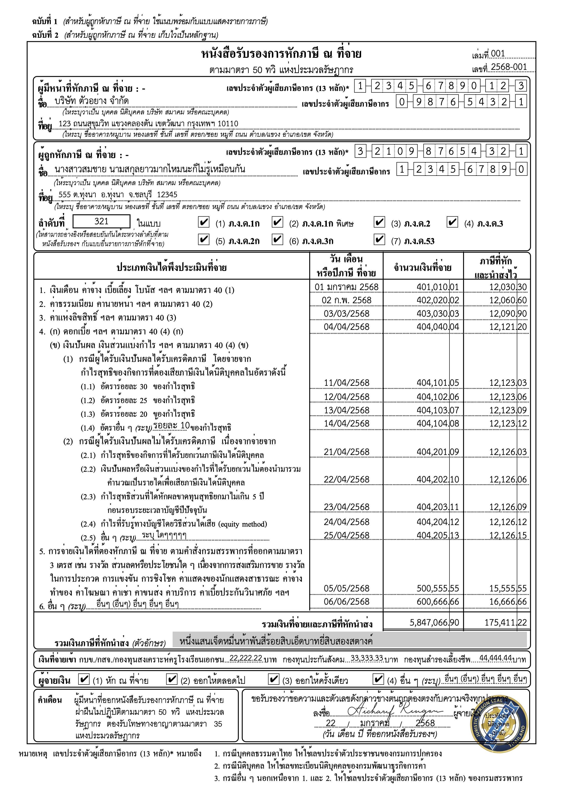

# taxform50tawi
โปรแกรมสำหรับกรอกข้อมูลและประทับตราลงในไฟล์ PDF แบบฟอร์มหนังสือรับรองการหักภาษี ณ ที่จ่าย (แบบ 50 ทวิ) โดยอัตโนมัติ เหมาะสำหรับธุรกิจและผู้ใช้งานที่ต้องการสร้างเอกสารภาษีที่ถูกต้องครบถ้วน พร้อมรองรับการใช้งานในระบบ CLI และพัฒนาโดยภาษา Go

# ตัวอย่างผลลัพธ์

## แนะนำไลบรารี

- bahttext : ไลบรารีสำหรับแปลงตัวเลขเป็นตัวอักษรภาษาไทย (https://github.com/anuchito/bahttext)
- currency formatter : ไลบรารีสำหรับแปลงตัวเลขเป็นตัวอักษรภาษาไทย (https://github.com/anuchito/currency-formatter)
- date thai formatter : ไลบรารีสำหรับแปลงวันที่เป็นภาษาไทย (https://github.com/anuchito/date-thai-formatter) buddhist year, full thai month, abbreviation thai month

## ขนาดรูป (พื้นหลังโปร่งใส png)
- must be png
- ลายเซ็นต์ มีขนาดเดียว : 1280x720px 
- โลโก้ มีขนาด 2 ขนาด
    - โลโก้ สี่เหลี่ยมจัตุรัสหรือวงกลม :  1024x1024px 
    - โลโก้ รูปสี่เหลี่ยมผืนผ้า : 1280x720px 

## ปัญหาที่พบ
- ไม่รองรับ "%" ตัวอักษรในส่วนของ Income40_4B_1_4_Rate

## แนะนำความสามารถ
- fully fill any fields in tax info
- fully suppor thai language no alien language show หมดปัญหาภาษาต่างดาว หรือ font ไม่รองรับ
- well align any fields in tax info จัดย่อหน้าให้สวยงาม
- มีการทดสอบที่ครบถ้วน